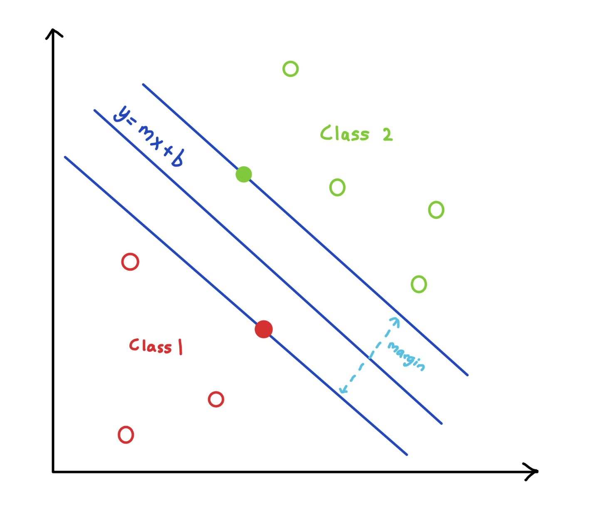

# Support Vector Machine and Indicators Trading Strategy

**A Trading Strategy Implementation using Support Vector Machines with Simple Moving Average and Relative Strength Indicator**

---

**Theoretical Topics:** *Technical Indicators, Momentum Trading, Sharpe Ratio, Support Vector Machines, Machine Learning*

**Tools / Technologies:** *Python, Backtrader, Yahoo Finance, Scikit-Learn, Pandas, Numpy, Matplotlib, Seaborn, Datetime*

---

### **Technical Explanation:**

1. RSI Trdaing Strategy -- [RSITradingStrategyImplementation.py](https://github.com/harshp30/SVMIndicatorsTradingStrategyImplementation/blob/main/src/RSITradingStrategyImplementation.py)

    *What is Relative Strength Indicator (RSI)?*

    > The Relative Strength Indicator helps identify bullish and beraish price momentum by measuring overbought an oversold conditions in the price of an asset

    In this case we are using RSI to create a trading strategy alongside a short and long moving average crossover strategy

    *Setup*

    Overview the short and long moving average crossover summary
    - short_ma > long_ma --> Buy
    - short_ma < long_ma --> Sell

    I focused on IBM stock where we get the stokc price from 2015-2020'. In order to run this strategy there there are various variables. 

    - The inital capital ($100)
    - stock ('IBM')
    - short_period (40 days -- The span of days over which the short moving average will be calculated)
    - long_period (150 days -- The span of days over which the long moving average will be calculated)

    After these initlaization we constrict the finals and this is where we calculate the RSI (Always a number between 0-100)

    The formual reads:

    `RSI = 100 - [(100) / (1 + (Averge Gain / Average Loss))]`

    In code this becomes: 

    ```
    relative_strength = self.data['average_gain'] / self.data['average_loss']
    self.data['rsi'] = 100.0 - (100.0 / (1.0 + relative_strength))
    ```

    As a general rule of thumb:
    - An asset is considered to be oversold if RSI < 30
    - An asset is considered to be overtbought if RSI > 30

    So in our strategy when we check if we should buy we also make sure the RSI < 30
    
    In code Selling and buying conditions looks like the following:

    ```
    # Selling 
    if row['short_ma'] < row['long_ma']

    # Buying
    if row['short_ma'] > row['long_ma'] and row['rsi'] < 30:
    ```

    *Plot*

    In the first plot below we see the IBM Stock price (grey), we see the short moving average (blue), and we see the long moving average (green). So with the RSI Crossover Strategy we buy or sell based on the short moving average and long moving average points crossing over

    

    In this second plot the green line represents our equity with inital capital being $100

    

    &nbsp;

2. MomentumSMATradingStrategyImplementation -- [MomentumSMATradingStrategyImplementation.py](https://github.com/harshp30/SVMIndicatorsTradingStrategyImplementation/blob/main/src/MomentumSMATradingStrategyImplementation.py)

    *What is Simple Moving average (SMA)?*

    > Simple Moving Average is the arithmetic mean of a given asset's price over a specific number of days in the past. This is a very basic indicator used to filter out noise from stock price data

    *What is Momentum Based Trading?*

    > This startegy revolves around finding stocks with high momentum, which means the stock price is expected to increase. Based on the momentum a long position is opened or closed where the size of the position is calculated using Average True Range (ATR) indicator

    In this case we a combined SMA and Momentum based Trading Strategy to find high momentum stocks over a long period of time

    *Setup*

    This implementation uses the Backtrader library which helps in strategy development and testing for algorithmic traders. This essentially saves us time by not having to implement every single strategy or indicator from scratch (example SMA)

    The backtrader framework strates with the initilization of cerebro (which acts as a central point) and then we mount the strategy, analyszers, and data to then run the trading strategy

    ```
    # Example
    cerebro.addanalyzer(bt.analyzers.SharpeRatio, riskfreerate=0.0)
    cerebro.addstrategy(MomentumStrategy)
    cerebro.adddata(bt.feeds.PandasData(dataname=df))
    ```

    To measure the momentum on a stock we also need ot calculate Average True Range (ATR) Indictaor

    > ATR is used to measure market volatility by measuring the entire range of an asset price for a given period

    We then use the ATR to calculate the size of the position we open

    `True Range (TR) = max{High Value - Low Value, ABS(High Value - Closing Price Yesterday), ABS(Low Value - Closing Price Yesterday)}`

    `ATR = 1/N * Σ[N - i=1] TR[i]`

    `size = (cpaital * risk factor) / (ATR[X amount of time])`

    So the strategy itself revolves around organizing the possible stocks by there calculated momentum, we only open/hold long posiitons on stocks in the top 20%. If we chose to open a position we check that the stock is in the top 20$ of momentum and use ATR to calculate the size of the position. We can also open them when SMA is below the S&P500 index. We close these positions if the stock falls out of the top 20% momentumm or the stock price falls below the 100 day Moving Average. 

    ```
    # Open Position
    for index, single_stock in enumerate(self.sorted_data[:int(num_stocks * 0.2)]):
        cash = self.broker.get_cash()
            value = self.broker.get_value()
            if cash > 0 and not self.getposition(self.data).size:
                # 0.001 is chosen risk factor
                size = value * 0.001 / self.indicators[single_stock]['atr20']
                self.buy(single_stock, size=size)

    if self.spy < self.sma200:

    # Close Position
    if index > 0.2 * num_stocks or single_stock < self.indicators[single_stock['sma100']]:
    ```

    The key analyzer/metric of the strategy is called the Sharpe Ratio

    > The Sharpe Ratio describes how much excess return you are recieveing for any extra volatility you endure holding a riskier asset (example stock). Sharpe Ratio is the most important risk and return measure used in quanititative finance

    To calculate Sharpe Ratio you would use the following formula

    `S(x) = (r[x] - R[f]) / (σ(x))`

    - r[x] = average rate of return for investment x
    - R[f] = rate of return of a risk free security
    - σ = standard deviation

    A Sharpe ratio > 1.0 is considered to be good

    In this case some the results (with intial capital: $100000.00) we got were:
    - Sharpe: 1.176
    - Final Capital: $400814.02

    &nbsp;

3. SVM with SMA and RSI Trading Strategy Implementation -- [SVMIndicatorsTradingStrategyImplementation.py](https://github.com/harshp30/SVMIndicatorsTradingStrategyImplementation/blob/main/src/SVMIndicatorsTradingStrategyImplementation.py)

    *What is Support Vector Machine (SVM)?*

    > A support vector machine (SVM) is a supervised machine learning model that uses classification algorithms for two-group classification problems

    In this case we are using SVM combined with RSI Indicators to create a complete trading strategy

    With SVMs the goal is the maximize the margin on either side of the linear `y = mx + b` function. The points that are closest to the maximum margin are called support vectors, These support vectors store the information for the decision boundary.
    
    

    In certain situations the function for the linear line may not be very clear like it is in the plot above. This is when we owuld use the "Kernel Trick"

    The kernel function allows us to transform the problem into higher dimenional spaces where the points are linearly seperable. 

    `L(α)[max] = Σ[i=1]α[i] - 1/2 Σ[i=1]Σ[j=1]α[i]α[j]y[i]y[j](x[i]*x[j])`

    This image from [medium](https://medium.com/@zxr.nju/what-is-the-kernel-trick-why-is-it-important-98a98db0961d) is a good representation

    

    *Setup*

    This implementation is unique due to the machine learning compoenent. However to set up the data to perform the Machine Learning Componenet we have to do the following:
    - Fetch the data in this case EURUSD=X from 2018 to 2020
    - Construct the signals for SMA, trend, RSI, and direction

    After these have all been gathered we select the feature and target columns, in this case we have trend and RSI for feature and direction for target. Essentially what this means is that the ML model will use the feature columns to make predictions on the target column

    We then create the traina nd test data with a 80-20 split. This means that 20% of the dataset is reserved for testing purposes

    ```
    X_train, X_test, y_train, y_test = train_test_split(X, y, test_size=0.2)
    ```

    Now we use the SVC (Support vector Classifier) as the model. 
    
    We fit the training data and then perform a grid search to find the optimized parameters between gamma and C

    ```
    parameters = {'gamma': [10, 1, 0.1, 0.01, 0.001],
                  'C': [1, 10, 100, 1000, 10000]}
    grid = list(ParameterGrid(parameters))

    best_accuracy = 0
    best_parameter = None

    for p in grid:
        svm = SVC(C=p['C'], gamma=p['gamma'])
        svm.fit(X_train, y_train)
        predictions = svm.predict(X_test)
        # check condition to find best params
        if accuracy_score(y_test, predictions) > best_accuracy:
            best_accuracy = accuracy_score(y_test, predictions)
            best_parameter = p
    ```

    Then reassign the models with the best parameters and compute performance metrics

    ```
    print('Accuracy of the model: %.2f' % accuracy_score(y_test, predictions))
    print(confusion_matrix(predictions, y_test))

    # Create confusion matrix to visualize results
    cf_matrix = confusion_matrix(predictions, y_test)

    ax = plt.subplot()
    sn.heatmap(cf_matrix, annot=True, fmt='g', ax=ax, cmap='Blues', cbar=False)
    ```

    *Plot*

    This is the Confusion Matrix for the SVM model. This has an accuracy of 66%. It predicted 61 properly predicted dircetions and 32 incorrect direction predictions.

    

---

### Next Steps:

- The ML model can be trained on an expanded search space for the parameter, something like raytune could be used to use a smart search algorithm to perform hyperparemeter tuning rather then brute force
- Differnt models could be explored to see if there is a better suited machine learning model for this specific classification

---

### Additional Notes:

- Results of the model is attached in [Results.txt](https://github.com/harshp30/SVMIndicatorsTradingStrategyImplementation/blob/main/Results.txt)
- Data is provided by [Holczer Balazs](https://www.udemy.com/course/quantitative-finance-algorithmic-trading-ii-time-series/) 